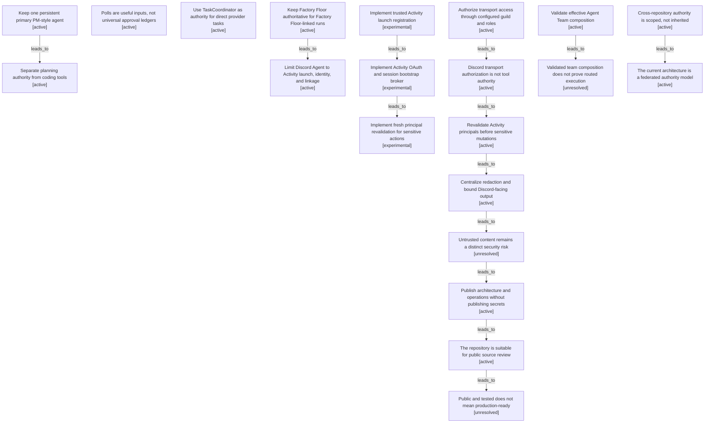

# Authority and security boundary map

Filtered from the canonical graph. Nodes may appear in several maps when one decision affected multiple boundaries.

| Semantic node | Type | Lifecycle | Current | Decision or outcome |
|---|---|---|---:|---|
| `decision.primary-pm-agent` | decision | active | yes | Keep one persistent primary PM-style agent |
| `decision.primary-tool-isolation` | decision | active | yes | Separate planning authority from coding tools |
| `observation.polls-are-not-universal-ledgers` | observation | active |  | Polls are useful inputs, not universal approval ledgers |
| `decision.taskcoordinator-direct-runtime` | decision | active | yes | Use TaskCoordinator as authority for direct provider tasks |
| `decision.factory-floor-authority` | decision | active | yes | Keep Factory Floor authoritative for Factory Floor-linked runs |
| `decision.discord-agent-activity-adapter` | decision | active | yes | Limit Discord Agent to Activity launch, identity, and linkage |
| `action.activity-trusted-launch` | action | experimental |  | Implement trusted Activity launch registration |
| `action.activity-oauth-bootstrap` | action | experimental |  | Implement Activity OAuth and session bootstrap broker |
| `action.activity-principal-revalidation` | action | experimental |  | Implement fresh principal revalidation for sensitive actions |
| `decision.private-guild-role-authorization` | decision | active | yes | Authorize transport access through configured guild and roles |
| `observation.transport-auth-not-tool-authority` | observation | active | yes | Discord transport authorization is not tool authority |
| `action.fresh-principal-revalidation` | action | active | yes | Revalidate Activity principals before sensitive mutations |
| `decision.redaction-and-bounded-output` | decision | active | yes | Centralize redaction and bound Discord-facing output |
| `observation.untrusted-content-remains-risk` | observation | unresolved |  | Untrusted content remains a distinct security risk |
| `decision.public-documentation-boundary` | decision | active | yes | Publish architecture and operations without publishing secrets |
| `outcome.public-repository-ready` | outcome | active | yes | The repository is suitable for public source review |
| `outcome.public-not-production-ready` | outcome | unresolved |  | Public and tested does not mean production-ready |
| `action.agent-team-composition-validation` | action | active | yes | Validate effective Agent Team composition |
| `observation.agent-team-composition-not-routing` | observation | unresolved |  | Validated team composition does not prove routed execution |
| `observation.cross-repo-authority-is-scoped` | observation | active | yes | Cross-repository authority is scoped, not inherited |
| `outcome.federated-authority-model` | outcome | active | yes | The current architecture is a federated authority model |
