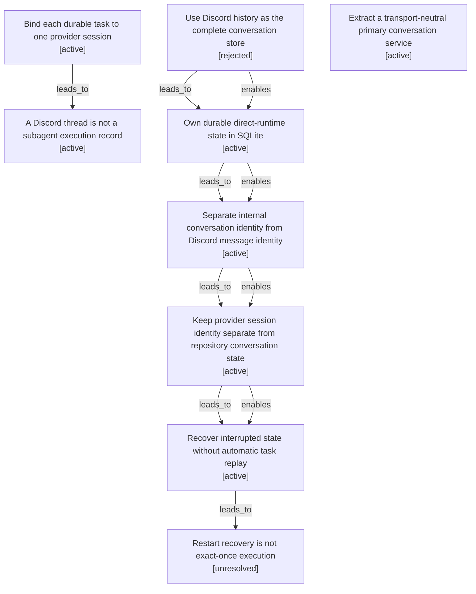

# Conversation identity map

Filtered from the canonical graph. Nodes may appear in several maps when one decision affected multiple boundaries.

| Semantic node | Type | Lifecycle | Current | Decision or outcome |
|---|---|---|---:|---|
| `option.discord-history-as-canonical-state` | option | rejected |  | Use Discord history as the complete conversation store |
| `decision.provider-fixed-task-sessions` | decision | active | yes | Bind each durable task to one provider session |
| `observation.thread-is-not-execution` | observation | active | yes | A Discord thread is not a subagent execution record |
| `decision.sqlite-durable-state` | decision | active | yes | Own durable direct-runtime state in SQLite |
| `decision.internal-conversation-id` | decision | active | yes | Separate internal conversation identity from Discord message identity |
| `decision.provider-session-separate` | decision | active | yes | Keep provider session identity separate from repository conversation state |
| `action.restart-recovery-without-replay` | action | active | yes | Recover interrupted state without automatic task replay |
| `observation.restart-is-not-exactly-once` | observation | unresolved |  | Restart recovery is not exact-once execution |
| `decision.transport-neutral-primary-conversation` | decision | active | yes | Extract a transport-neutral primary conversation service |
