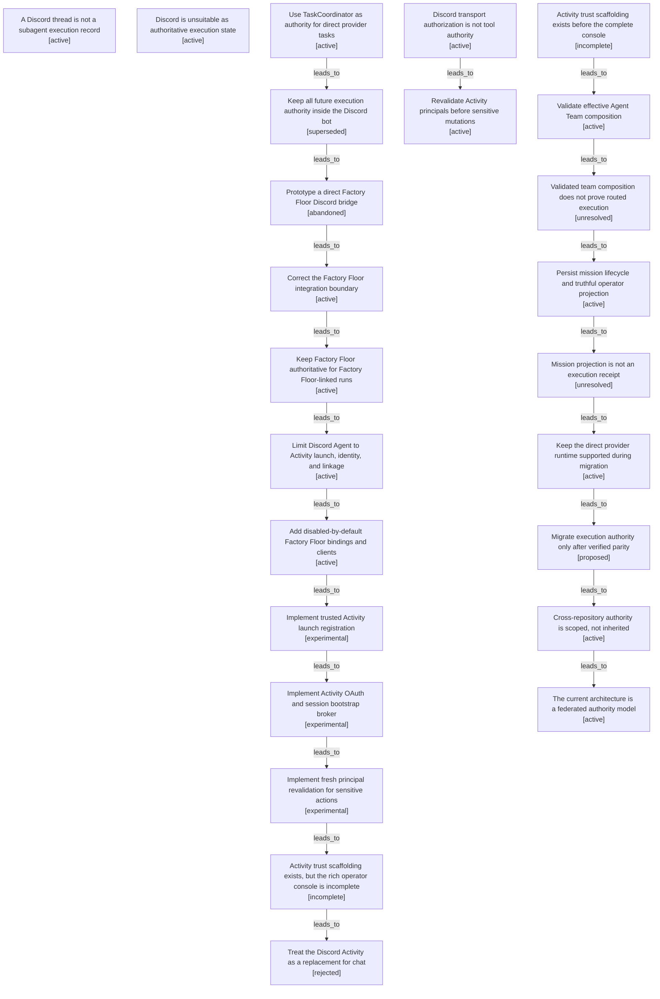

# Factory Floor integration boundary map

Filtered from the canonical graph. Nodes may appear in several maps when one decision affected multiple boundaries.

| Semantic node | Type | Lifecycle | Current | Decision or outcome |
|---|---|---|---:|---|
| `observation.thread-is-not-execution` | observation | active | yes | A Discord thread is not a subagent execution record |
| `observation.discord-not-authoritative-runtime` | observation | active | yes | Discord is unsuitable as authoritative execution state |
| `decision.taskcoordinator-direct-runtime` | decision | active | yes | Use TaskCoordinator as authority for direct provider tasks |
| `option.run-all-work-in-bot-process` | option | superseded |  | Keep all future execution authority inside the Discord bot |
| `action.factory-floor-bridge-attempt` | action | abandoned |  | Prototype a direct Factory Floor Discord bridge |
| `revisit.factory-floor-integration-boundary` | revisit | active |  | Correct the Factory Floor integration boundary |
| `decision.factory-floor-authority` | decision | active | yes | Keep Factory Floor authoritative for Factory Floor-linked runs |
| `decision.discord-agent-activity-adapter` | decision | active | yes | Limit Discord Agent to Activity launch, identity, and linkage |
| `action.factory-floor-bindings-client` | action | active | yes | Add disabled-by-default Factory Floor bindings and clients |
| `action.activity-trusted-launch` | action | experimental |  | Implement trusted Activity launch registration |
| `action.activity-oauth-bootstrap` | action | experimental |  | Implement Activity OAuth and session bootstrap broker |
| `action.activity-principal-revalidation` | action | experimental |  | Implement fresh principal revalidation for sensitive actions |
| `outcome.activity-integration-partial` | outcome | incomplete |  | Activity trust scaffolding exists, but the rich operator console is incomplete |
| `option.activity-replaces-chat` | option | rejected |  | Treat the Discord Activity as a replacement for chat |
| `observation.transport-auth-not-tool-authority` | observation | active | yes | Discord transport authorization is not tool authority |
| `action.fresh-principal-revalidation` | action | active | yes | Revalidate Activity principals before sensitive mutations |
| `observation.activity-console-incomplete` | observation | incomplete |  | Activity trust scaffolding exists before the complete console |
| `action.agent-team-composition-validation` | action | active | yes | Validate effective Agent Team composition |
| `observation.agent-team-composition-not-routing` | observation | unresolved |  | Validated team composition does not prove routed execution |
| `action.mission-lifecycle-projection` | action | active | yes | Persist mission lifecycle and truthful operator projection |
| `observation.mission-projection-not-execution` | observation | unresolved |  | Mission projection is not an execution receipt |
| `decision.direct-runtime-remains-supported` | decision | active | yes | Keep the direct provider runtime supported during migration |
| `revisit.factory-floor-execution-migration` | revisit | proposed |  | Migrate execution authority only after verified parity |
| `observation.cross-repo-authority-is-scoped` | observation | active | yes | Cross-repository authority is scoped, not inherited |
| `outcome.federated-authority-model` | outcome | active | yes | The current architecture is a federated authority model |
