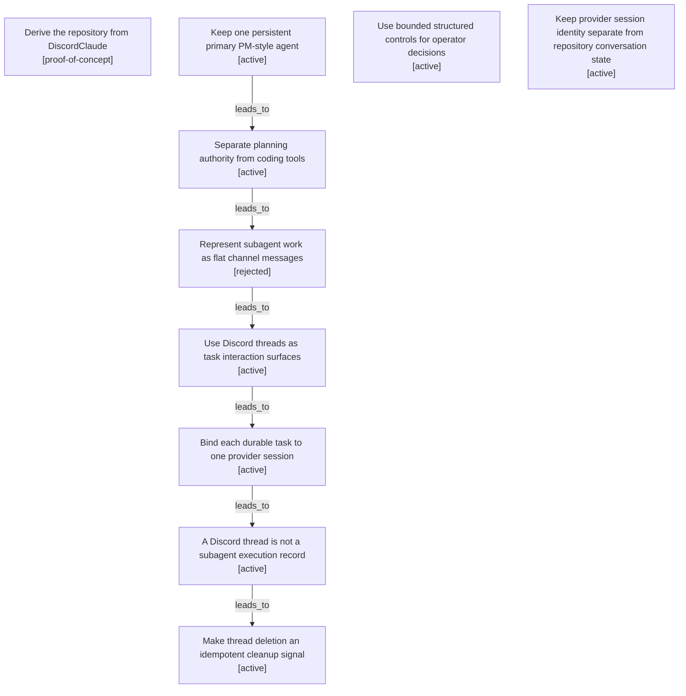

# Primary agent and subagent-thread evolution map

Filtered from the canonical graph. Nodes may appear in several maps when one decision affected multiple boundaries.

| Semantic node | Type | Lifecycle | Current | Decision or outcome |
|---|---|---|---:|---|
| `action.import-discordclaude-poc` | action | proof-of-concept |  | Derive the repository from DiscordClaude |
| `decision.primary-pm-agent` | decision | active | yes | Keep one persistent primary PM-style agent |
| `decision.primary-tool-isolation` | decision | active | yes | Separate planning authority from coding tools |
| `option.flat-subagent-messages` | option | rejected |  | Represent subagent work as flat channel messages |
| `decision.task-threads-as-interaction-surfaces` | decision | active | yes | Use Discord threads as task interaction surfaces |
| `decision.provider-fixed-task-sessions` | decision | active | yes | Bind each durable task to one provider session |
| `observation.thread-is-not-execution` | observation | active | yes | A Discord thread is not a subagent execution record |
| `action.thread-delete-cleanup` | action | active |  | Make thread deletion an idempotent cleanup signal |
| `decision.structured-decisions` | decision | active | yes | Use bounded structured controls for operator decisions |
| `decision.provider-session-separate` | decision | active | yes | Keep provider session identity separate from repository conversation state |
