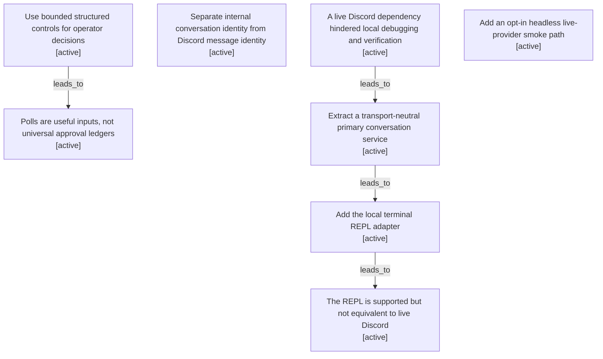

# REPL evolution map

Filtered from the canonical graph. Nodes may appear in several maps when one decision affected multiple boundaries.

| Semantic node | Type | Lifecycle | Current | Decision or outcome |
|---|---|---|---:|---|
| `decision.structured-decisions` | decision | active | yes | Use bounded structured controls for operator decisions |
| `observation.polls-are-not-universal-ledgers` | observation | active |  | Polls are useful inputs, not universal approval ledgers |
| `decision.internal-conversation-id` | decision | active | yes | Separate internal conversation identity from Discord message identity |
| `observation.discord-coupling-hindered-development` | observation | active |  | A live Discord dependency hindered local debugging and verification |
| `decision.transport-neutral-primary-conversation` | decision | active | yes | Extract a transport-neutral primary conversation service |
| `action.terminal-repl` | action | active | yes | Add the local terminal REPL adapter |
| `outcome.repl-supported-harness-not-discord-equivalent` | outcome | active | yes | The REPL is supported but not equivalent to live Discord |
| `action.headless-agent-smoke` | action | active | yes | Add an opt-in headless live-provider smoke path |
