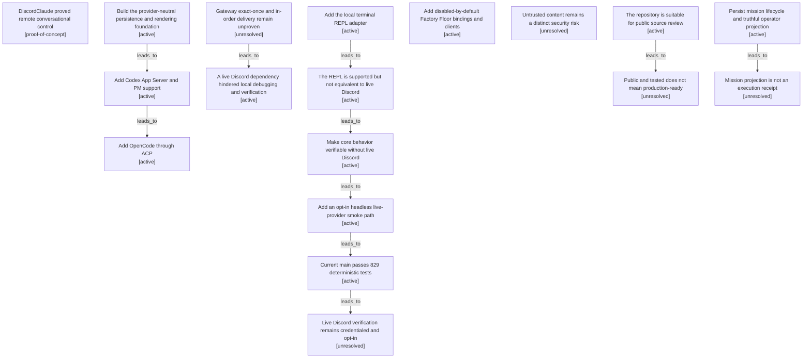

# Testing and verification map

Filtered from the canonical graph. Nodes may appear in several maps when one decision affected multiple boundaries.

| Semantic node | Type | Lifecycle | Current | Decision or outcome |
|---|---|---|---:|---|
| `outcome.poc-proved-remote-agent-control` | outcome | proof-of-concept |  | DiscordClaude proved remote conversational control |
| `action.provider-neutral-foundation` | action | active |  | Build the provider-neutral persistence and rendering foundation |
| `action.add-codex-provider` | action | active |  | Add Codex App Server and PM support |
| `action.add-opencode-provider` | action | active |  | Add OpenCode through ACP |
| `observation.gateway-exactly-once-unverified` | observation | unresolved |  | Gateway exact-once and in-order delivery remain unproven |
| `observation.discord-coupling-hindered-development` | observation | active |  | A live Discord dependency hindered local debugging and verification |
| `action.terminal-repl` | action | active | yes | Add the local terminal REPL adapter |
| `outcome.repl-supported-harness-not-discord-equivalent` | outcome | active | yes | The REPL is supported but not equivalent to live Discord |
| `decision.deterministic-offline-tests` | decision | active | yes | Make core behavior verifiable without live Discord |
| `action.headless-agent-smoke` | action | active | yes | Add an opt-in headless live-provider smoke path |
| `outcome.current-deterministic-verification` | outcome | active | yes | Current main passes 829 deterministic tests |
| `observation.live-discord-remains-credentialed` | observation | unresolved |  | Live Discord verification remains credentialed and opt-in |
| `action.factory-floor-bindings-client` | action | active | yes | Add disabled-by-default Factory Floor bindings and clients |
| `observation.untrusted-content-remains-risk` | observation | unresolved |  | Untrusted content remains a distinct security risk |
| `outcome.public-repository-ready` | outcome | active | yes | The repository is suitable for public source review |
| `outcome.public-not-production-ready` | outcome | unresolved |  | Public and tested does not mean production-ready |
| `action.mission-lifecycle-projection` | action | active | yes | Persist mission lifecycle and truthful operator projection |
| `observation.mission-projection-not-execution` | observation | unresolved |  | Mission projection is not an execution receipt |
