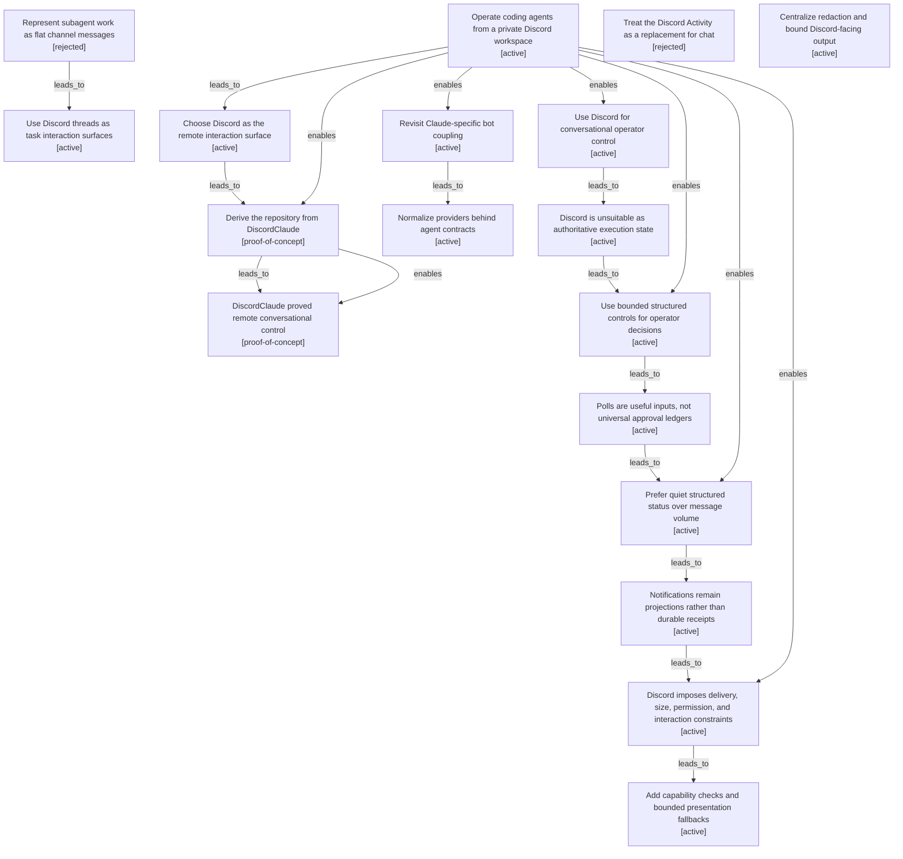

# Discord transport and interaction model

Filtered from the canonical graph. Nodes may appear in several maps when one decision affected multiple boundaries.

| Semantic node | Type | Lifecycle | Current | Decision or outcome |
|---|---|---|---:|---|
| `goal.private-discord-agent-workspace` | goal | active | yes | Operate coding agents from a private Discord workspace |
| `option.discord-conversational-surface` | option | active | yes | Choose Discord as the remote interaction surface |
| `action.import-discordclaude-poc` | action | proof-of-concept |  | Derive the repository from DiscordClaude |
| `outcome.poc-proved-remote-agent-control` | outcome | proof-of-concept |  | DiscordClaude proved remote conversational control |
| `revisit.claude-specific-coupling` | revisit | active |  | Revisit Claude-specific bot coupling |
| `decision.provider-neutral-contracts` | decision | active | yes | Normalize providers behind agent contracts |
| `option.flat-subagent-messages` | option | rejected |  | Represent subagent work as flat channel messages |
| `decision.task-threads-as-interaction-surfaces` | decision | active | yes | Use Discord threads as task interaction surfaces |
| `decision.discord-operator-interface` | decision | active | yes | Use Discord for conversational operator control |
| `observation.discord-not-authoritative-runtime` | observation | active | yes | Discord is unsuitable as authoritative execution state |
| `decision.structured-decisions` | decision | active | yes | Use bounded structured controls for operator decisions |
| `observation.polls-are-not-universal-ledgers` | observation | active |  | Polls are useful inputs, not universal approval ledgers |
| `decision.quiet-structured-notifications` | decision | active | yes | Prefer quiet structured status over message volume |
| `outcome.notifications-are-projections` | outcome | active | yes | Notifications remain projections rather than durable receipts |
| `observation.discord-platform-constraints` | observation | active |  | Discord imposes delivery, size, permission, and interaction constraints |
| `action.capability-aware-delivery` | action | active | yes | Add capability checks and bounded presentation fallbacks |
| `option.activity-replaces-chat` | option | rejected |  | Treat the Discord Activity as a replacement for chat |
| `decision.redaction-and-bounded-output` | decision | active | yes | Centralize redaction and bound Discord-facing output |
